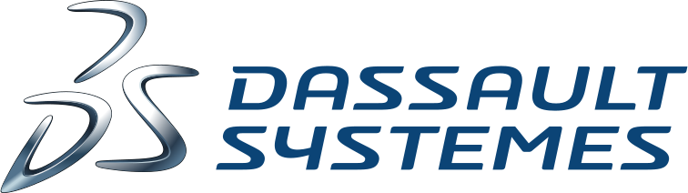

Meet the experts on the booth to get all the answers about Dymola and 3DExperience and... have a great experience with Playmola Live!

Dassault Systèmes, the 3DEXPERIENCE Company, provides business and people with virtual universes to imagine sustainable innovations. Its world-leading solutions transform the way products are designed, produced, and supported. Dassault Systèmes’ collaborative solutions foster social innovation, expanding possibilities for the virtual world to improve the real world. The group brings value to over 190,000 customers of all sizes, in all industries, in more than 140 countries. For more information, visit <a href="www.3ds.com">www.3ds.com</a>.

Dassault Systèmes has long supported the use of the Modelica modeling language for the complex systems engineering at the core of the company’s flagship brand CATIA. In CATIA Brand, Dymola, Dynamic Modeling Laboratory, is a Modelica compliant solution that efficiently models and simulates multi-physic dynamic systems. Dymola rapidly solves complex multi-disciplinary systems modeling problems that can contain a combination of mechanical, electrical, electronic, hydraulic, thermal, control, electric power or process-oriented characteristics and components. CATIA 3DEXPERIENCE provides DYMOLA capabilities, fully integrated within the 3DEXPERIENCE Platform.

In addition to, Modelica systems libraries are developed by domain specialists. Used in conjunction with Dassault Systèmes' Modelica based solutions (either CATIA 3DEXPERIENCE or Dymola) to quickly model and simulate the behavior of complex systems that span multiple engineering disciplines - from flight and vehicle dynamics.

