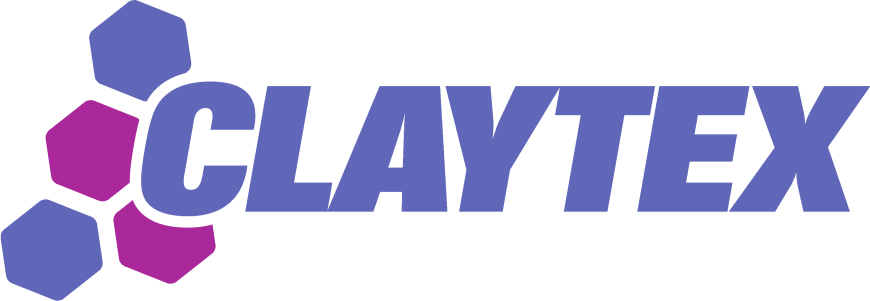

Claytex is an engineering consultancy that specialises in systems engineering, modelling and simulation. Our core competency is in the modelling and simulation of complex multi-domain systems using Modelica and FMI. In addition to working on customer projects, we develop a number of Modelica application libraries and FMI based tools. At Modelica 2015 we will introduce a new library for modelling batteries and a new version of the FMI Blockset which now provides support for Microsoft Excel in addition to Simulink.  We will also have new releases of our existing Modelica application libraries available.

