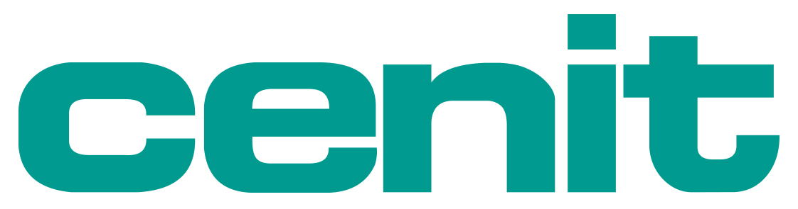

CENIT AG, based in Stuttgart, has been active as a consulting and software specialist for optimizing business processes since 1988.
With about 700 staff, the publicly listed enterprise supports clients around the world from nine locations in Germany and five subsidiaries abroad.
Over the past 25 years, CENIT has grown into one of the leading PLM consulting and implementation partners for manufacturing enterprises.
As a one-stop shop for PLM, CENIT offers a comprehensive consulting, service and software portfolio based on Dassault Systèmes and SAP applications, and it has developed proprietary solutions to enhance its partners’ solutions.

