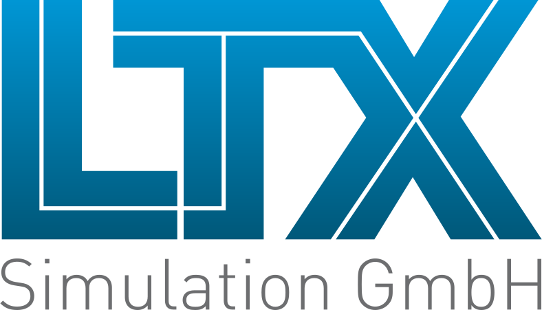

LTX Simulation GmbH provides support in the selection, development
and optimization of solutions for system simulations based on
Modelica, FMI and Dymola. LTX gives a wide support, develops
custom-made solutions and provides training courses. Furthermore LTX
distributes model libraries and software from XRG Simulation GmbH,
TLK-Thermo GmbH and other developers.
The close and extensive collaboration of the three companies
(<a href="http://www.ltx.de">LTX</a>,
<a href="http://www.tlk-thermo.com/">TLK</a> and
<a href="http://www.xrg-simulation.de/">XRG</a>)
ensures the optimum support for its customers.

