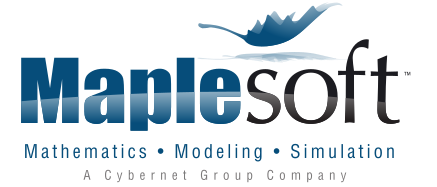

  MapleSim, the advanced system-level modeling and simulation tool from Maplesoft, is a Modelica-based tool that applies modern techniques to dramatically reduce development time, provide greater insight into system behaviour, and produce fast, high-fidelity simulations. The combination of the Modelica modeling language with the symbolic computation power of MapleSim enables a level of understanding, power, and extensibility that is not possible with “black-box” tools.

  Visitors to the Maplesoft booth will get a chance to see the latest improvements in MapleSim. MapleSim 2015 includes powerful new tools for managing large models more efficiently, as well updated Modelica support, new and updated components, more connectivity with Maple, and a variety of interface enhancements requested by customers.

