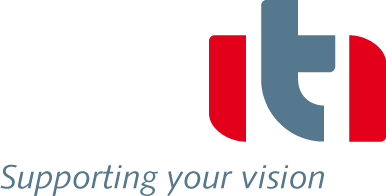

In the realm of system simulation, ITI is a leading developer of innovative software solutions and offers a vast range of engineering services that help to reduce time-to-market significantly. Our interdisciplinary software application SimulationX allows for comprehensive physical modeling of complex systems. Amongst others we support our customers in virtual prototyping, result interpretation and optimization of energy-efficient design. SimulationX supports the Modelica® language with open and complete CAx interfaces. ITI software solutions are applied by more than 700 well-known companies, such as Audi, BMW, Bureau Veritas, Daimler, Fraunhofer-Gesellschaft, Germanischer Lloyd, Honda, Nikon, Robert Bosch, Siemens, ThyssenKrupp, Veolia and ZF.

