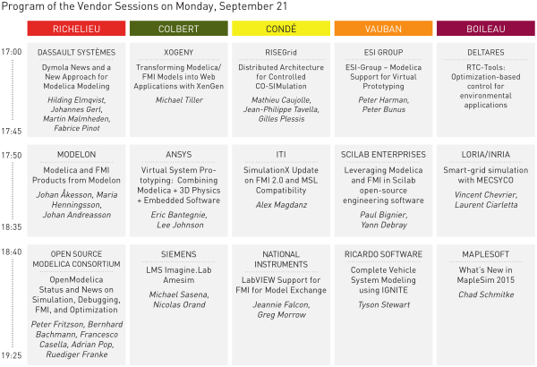

<h2>List of Vendor Sessions</h2>

</img>

The following companies/institutes will give vendor presentations (alphabetic order)

<ul><li><strong>Ansys </strong> 

<strong>Title:</strong> Virtual System Prototyping: &nbsp;Combining Modelica + 3D Physics + Embedded Software &nbsp;&nbsp;

<strong>Presenters:</strong> Eric Bantegnie and Lee Johnson

<strong>Abstract:</strong> &nbsp;ANSYS delivers unmatched capability and breadth for engineering simulation, with solutions spanning 3D physics, reduced-order modeling, embedded software, and multi-domain systems to support product development from detailed design through system integration.

Now, integrating technology from Modelon AB, ANSYS is introducing native support for Modelica and Modelon’s libraries within the Simplorer® physical modeling &amp; simulation platform – expanding its multi-domain capability and interoperability for high-fidelity system modeling and analysis.

In this session, we will introduce Modelica support in Simplorer, as a key enabler for modeling full virtual system prototypes assembled from a combination of multi-domain behavioral models, Reduced-Order Models from 3D physics simulation, and embedded software.  

</li><li><strong>Dassault Systèmes </strong>

 <strong>Title:</strong> Dymola News and a New Approach for Modelica Modeling

<strong>Presenters:</strong> Hilding Elmqvist, Johannes Gerl, Martin Malmheden, Fabrice Pinot

<strong>Abstract:</strong>&nbsp;In this session, the following key topics will be addressed:

- Dymola and CATIA 3DEXPERIENCE - Dymola Behavior Modeling latest releases will be presented. For instance, user interface and ergonomic or plotting capabilities have been enhanced and Functional Mockup Interface &nbsp;support continues with new features. In addition, On CATIA 3DEXPERIENCE R2015x, full integration of CATIA 3D Mechanism (kinematics) with Dymola Behavior Modeling has been performed.&nbsp;

- Our library portfolio is extending with HumanComfort Library from XRG Simulation. This library models the dynamic and thermal behavior of buildings, vehicles, ship and aircraft cabins for thermal comfort of persons. It contains the modular description of all physical heat transfer processes.

- On April 23rd 2015, &nbsp; Dassault Systèmes Acquired Modelon GmbH, expert in “ready-to-experience” content for systems modeling and simulation. As part of Dassault Systèmes, 3DS GmbH will expand the reach and impact of his assets to inspire electrified and ecologic product development that will be emblematic of the bright future of experience-based systems engineering.

- Furthermore, a demonstration of a new approach and new web-based technologies for 3D Modelica authoring will be made. It is based on 3D component representations and the model composition is made in a 3D scene. &nbsp;A game-inspired and virtual reality prototype with codename Playmola will be demonstrated. Details are given in the paper “3D Schematics of Modelica Models and Gamification”.

Dassault Systèmes, the 3DEXPERIENCE Company, provides business and people with virtual universes to imagine sustainable innovations. Its world-leading solutions transform the way products are designed, produced, and supported. Dassault Systèmes’ collaborative solutions foster social innovation, expanding possibilities for the virtual world to improve the real world. The group brings value to over 190,000 customers of all sizes, in all industries, in more than 140 countries. For more information, visit www.3ds.com.  

</li><li><strong>Deltares &nbsp;  </strong> 

<strong>Title:&nbsp;</strong>RTC-Tools: Optimization-based control for environmental applications

<strong>Presenters:</strong>&nbsp;

<strong>Abstract:</strong>&nbsp;Deltares offers an open-source toolbox for the model predictive control of environmental systems, RTC-Tools. The toolbox integrates seamlessly with Deltares FEWS, an operational forecasting and planning system. RTC-Tools and FEWS are used together as operational forecasting and decision support systems for heat networks, water boards, and hydro power authorities. As of recent, RTC-Tools can operate on Modelica models through its FMI 2.0 interface. The possibility of providing models in Modelica opens up the powerful planning and forecasting capabilities of RTC-Tools and FEWS to new applications.  </li><li><strong>ESI Group </strong> 

<strong>Title: </strong>ESI-Group – Modelica Support for Virtual Prototyping &nbsp;

<strong>Presenters: </strong>Peter Harman and Peter Bunus

<strong>Abstract: </strong>ESI-Group is a pioneer and world-leading provider in Virtual Prototyping that takes into account the physics of materials. ESI boasts a unique know-how in Virtual Product Engineering, based on an integrated suite of coherent, industry-oriented applications. Based on Computational Fluid Dynamics (CFD), Finite Element Analysis (FEA) and Virtual Reality (VR) technologies, ESI has developed an extensive suite of integrated, industry-oriented applications: to realistically simulate a product’s behavior during testing; to fine-tune manufacturing processes in accordance with desired product performance; and to evaluate the environment’s impact on performance. &nbsp;ESI’s solutions fit into a single collaborative and open environment for End-to-End Virtual Prototyping thus reducing, even eliminating, the need for physical prototypes during product development.&nbsp;

Since the acquisition of CyDesign Labs Inc. in October 2013, ESI teams have worked on the integration of Modelica systems modeling technology into ESI’s software product portfolio. ESI’s area of expertise, Virtual Prototyping, offers manufacturers a disruptive approach to test and pre-certify their products while cutting cost and lead-time. The integration of Modelica technology (ESI-Xplorer) into ESI’s Computer-Aided Engineering (CAE) platform Visual Environment extends the scope of systems modeling to include virtual manufacturing, assembling and testing.

In this session we will provide an overview of our Modelica-based system modeling activities and introduce the audience to our new system modeling product line called ESI-Xplorer and highlight its benefits. The presentation will make reference to several practical industrial examples, will introduce the audience to our future product roadmap and highlight our ongoing partnerships that are of interest to the Modelica community.&nbsp;  

</li><li><strong>ITI </strong>  

<strong>Title:&nbsp;</strong>SimulationX Update on FMI 2.0 and MSL Compatibility

<strong>Presenters:</strong>&nbsp;Alex Magdanz

<strong>Abstract:</strong>&nbsp;SimulationX - in this vendor session we demonstrate selected features of the upcoming version SimulationX 3.7. &nbsp;Special features include support for FMI 2.0, comprehensive Modelica compatibility including the Modelica Standard Library and third-party libraries, and new advanced result visualization during the simulation. &nbsp;As a special topic we give a short preview of a new web-based simulation platform that will be presented in detail at the poster session.&nbsp; &nbsp; &nbsp; &nbsp; &nbsp; &nbsp; &nbsp; &nbsp;&nbsp;&nbsp;  </li><li><strong>LORIA/INRIA  </strong> 

<strong>Title:&nbsp;</strong>Smart-grid simulation with MECSYCO

<strong>Presenters:</strong>&nbsp;Vincent Chevrier,&nbsp;Laurent
Ciarletta

<strong>Abstract:</strong><em>&nbsp;</em>The presentation illustrates the current results of the platform called &nbsp;MECSYCO (Multi-agent Environment for Complex SYstems CO-simulation) in the context of smart grids simulation with different &nbsp;use cases based on real scenarios. We present different examples built in cooperation with EDF R&amp;D which require the integration of several heterogeneous &nbsp;simulators based on various formalisms: simulation of power grid involves several FMUs, communication simulation uses the event-based simulator NS-3, etc.&nbsp;  Through these examples we show the ability of the MECSYCO platform to integrate FMUs components together and with other types of simulators and to simulate the whole in a decentralized way. &nbsp;
  </li><li><strong>MapleSoft &nbsp; &nbsp; &nbsp; &nbsp; &nbsp; </strong> 

<strong>Title:&nbsp;</strong>What’s New in MapleSim 2015

<strong>Presenters:</strong>&nbsp;Chad Schmitke

<strong>Abstract:&nbsp;</strong>MapleSim combines system-level modeling and simulation with powerful analytic capabilities. Our goal with MapleSim is to provide engineers with an easy to use tool for design exploration and simulation.

In this session, we will provide an update on support of Modelica 3.2.1 as well as FMI 2.0, within MapleSim. We will also give an overview of new features in the MapleSim 2015 release, which make it even easier to manage complex system models. In particular, we will introduce functionality for navigating and searching within a model and for comparing different versions of a model.&nbsp;

A unique feature of MapleSim is the ability to bring simulation results into the interactive Maple document environment, where Maple’s 5000+ mathematical algorithms become available for post-processing, analysis and design exploration. Now with MapleSim 2015, you are able to deploy live analysis worksheets to a web server and we will show several examples of how you can change parameters, manipulate model equations, run simulations and explore results, via your web browser without needing access to MapleSim.  

</li><li><strong>Modelon </strong> 

<strong>Title:&nbsp;</strong>Modelica and FMI Products from Modelon

<strong>Presenters:</strong>&nbsp;Johan Åkesson, Maria Henningsson, Johan Andreasson

<strong>Abstract:&nbsp;</strong>This session presents Modelon’s offerings of
Modelica and FMI solutions. &nbsp;Modelica libraries for several physical
domains, including automotive, aerospace and energy, is highlighted and
demonstrated for selected applications. New features of Modelon’s FMI
connectivity products, including the FMI toolbox for MATLAB and the FMI Add-in
for Excel, are presented, as well as new optimization capabilities in
JModelica.org and the OPTIMICA Compiler Toolkit. In addition, a novel Modelica
and FMI cross test platform, the OPTIMICA Testing Toolkit is introduced.  

</li><li><strong>National Instruments </strong> 

<strong>Title:&nbsp;</strong>LabVIEW Support for FMI for Model Exchange

<strong>Presenters:</strong>&nbsp;Jeannie
Falcon and Greg Morrow

<strong>Abstract:</strong>&nbsp;LabVIEW system design software helps accelerate the productivity of engineers and scientists in multiple industries. &nbsp;Dynamic system simulation and control capabilities are included in the platform and can integrate with multi-domain models through recently released support for FMI model exchange. This presentation will include software demonstrations involving Model Exchange FMU's of version 1.0 and 2.0. Examples from JModelica and OpenModelica will be included as well as models from other commercial vendors.  

</li><li><strong>Open Source Modelica Consortium </strong> 

<strong>Title:</strong> OpenModelica Status and News on Simulation, Debugging, FMI, and Optimization

<strong>Presenters:</strong> Peter Fritzson, Bernhard Bachmann, Francesco Casella, Adrian Pop, Ruediger Franke

<strong>Abstract:&nbsp;</strong>OpenModelica is an open source environment supporting modeling, simulation, debugging, FMI 1.0/2.0, and optimization, developed by the non-profit organization Open Source Modelica Consortium. In this session we will present and demonstrate new and improved features in the upcoming OpenModelica 1.9.3 release, as well as enhanced model library support, improved prototypes for generation of parallel code and support of clocked synchronous Modelica features. Information on OpenModelica usage experience from industrial applications will be presented. On-line demonstrations of &nbsp;the improved graphical model editor, the unique model debugger, FMI 2.0 support, and new features in the dynamic optimizer will be given. Moreover, information about future plans will be presented.  

</li><li><strong>Ricardo Software </strong> 

<strong>Title:</strong> Complete Vehicle System Modeling using IGNITE

<strong>Presenters:</strong> Tyson Stewart (IGNITE Product Manager, Ricardo Software)

<strong>Abstract:</strong> IGNITE is a physics-based system simulation package focused on complete vehicle performance and fuel economy simulation. With an extensive collection of Modelica-based commercial libraries, developed by Ricardo Software, IGNITE enables a complete range of powertrain configurations and options to be considered and integrated. By providing a comprehensive set of vehicle system “building blocks”, IGNITE users can quickly and accurately model complete conventional, hybrid-electric, full electric and novel vehicle architectures. Faster than real-time simulation, combined with native design and optimization tools, provide quick turnaround of vehicle performance, fuel economy, emissions and thermal management prediction from concept through detailed powertrain integration. &nbsp;This allows users to make key decisions to deliver their efficiency goals in the most cost-effective and robust manner.  

</li><li><strong>RISEGrid &nbsp; &nbsp; &nbsp; &nbsp; &nbsp; &nbsp;&nbsp;  </strong>

<strong>Title:&nbsp;</strong>Distributed Architecture for Controlled CO-SIMulation

<strong>Presenters</strong>: Mathieu Caujolle, Jean-Philippe Tavella,&nbsp;Gilles Plessis

<strong>Abstract</strong>: RISEGrid (Research Institute for Smarter Electric Grids) was jointly launched by EDF (Electricité de France) and CentraleSupélec in December 2012. It is dedicated to the study, modelling and simulation of smart electric distribution grids and their interactions with the whole electric power system.&nbsp;

DACCOSIM is a FMI 2.0 compliant Master Algorithm designed by RISEGrid to execute co-simulations requiring the collaboration of multiple FMUs. The simulations can be distributed on multi-core computation machines and/or on cluster nodes.&nbsp;

The 2015 version of DACCOSIM will be available for downloading &nbsp;next September under the AGPL license.&nbsp;

The latest version of DACCOSIM, DACCOSIM 2016, will be demonstrated on a use case simulating heat transfers in a multi-floor building. Local and remote execution on cluster will be shown.&nbsp;  

</li><li><strong>Scilab Enterprises  </strong>

<strong>Title:&nbsp;</strong>Leveraging Modelica and FMI in Scilab
open-source engineering software

<strong>Presenters:</strong>&nbsp;Paul BIGNIER and Yann DEBRAY

<strong>Abstract:&nbsp;</strong>With more than 100,000 monthly installations by engineers and scientists worldwide, Scilab is the leading open source computing platform for engineering and scientific problem solving.

Scilab's Xcos allows to model and simulate dynamic hybrid systems in an easy-to-use graphical environment. Modelica brings acausality to Scilab's Xcos' traditional block diagrams in order to allow component-based physical modelling of potentially-coupled electrical, mechanical and thermodynamical systems.

Furthermore, the Functional Mock-Up Interface Standard has been recently implemented as a Scilab/Xcos module, allowing the Model-Exchange (Import &amp; Export) and co-simulation of Xcos models. This now enables systems engineers to leverage the power of open-source solutions within their company and with other companies and professionals (clients &amp; suppliers).  

</li><li><strong>Siemens &nbsp; &nbsp; &nbsp; &nbsp; &nbsp; &nbsp;&nbsp;  </strong>

<strong>Title:&nbsp;</strong>LMS Imagine.Lab Amesim

<strong>Presenters:</strong>&nbsp;Michael Sasena, Nicolas Orand

<strong>Abstract:</strong><em>&nbsp;</em>LMS Imagine.Lab Amesim from Siemens PLM Software is the core
software of the LMS Imagine.Lab platform. With its powerful facilities,
analysis and optimization tools, the modeling and simulation platform offers an
advanced and easy-to-use environment for 1D multi-domain system simulation and
robust design. The physically conservative multi-port modeling of physical
components as well as a block diagram approach for control systems enable the
coupling of all libraries within a built-in and comprehensive workflow.

LMS Imagine.Lab Amesim is an open platform. You can access
pre-existing libraries of comprehensive, validated, domain-specific models and
create custom libraries using a full-featured Modelica development environment.
You can also take advantage of LMS Amesim’s support for the FMI specification
(full FMI 1.0 support and FMI 2.0 co-sim master support). Assembled models are
compiled and executed to take advantage of a powerful set of analysis tools for
visualization, linear analysis and design exploration.

During the vendor presentation, the LMS Imagine.Lab Amesim
software will be demonstrated.&nbsp; While the main focus will be on the
Modelica platform, FMI features will also be presented.&nbsp; Participants will
see the latest features available in LMS Amesim 14, as well as get an advanced
preview of developments underway for LMS Amesim 15.  

</li><li><strong>Xogeny &nbsp; &nbsp;   </strong>

<strong>Title:&nbsp;</strong>Transforming Modelica/FMI Models into Web Applications with XenGen

<strong>Presenter:</strong>&nbsp;Michael Tiller

<strong>Abstract:</strong>&nbsp;Modelica and FMI have created unprecedented opportunities for creating high-quality models. &nbsp;But to truly demonstrate the value of these models, it is important that they can be used by as many people as possible.&nbsp;  For this reason, Xogeny has created the Xenarius Generator (or XenGen, for short) to provide an easy way to transform models into web-based engineering applications. &nbsp;The goal of the XenGen tool is to provide model developers with an effortless way to reach and serve new users. &nbsp;XenGen applications don't require any software to be installed because they are deployed as web applications that can run in any standard web browser (both on desktop and mobile devices). &nbsp;In addition to the generated user interface, the XenGen platform also provides back-end services for both data management and simulation.  Users of Modelica and FMI are already investing in model development. &nbsp;XenGen will allow you to greatly expand the return on that investment by getting those models into the hands of as many users as possible. </li></ul>

&nbsp;
